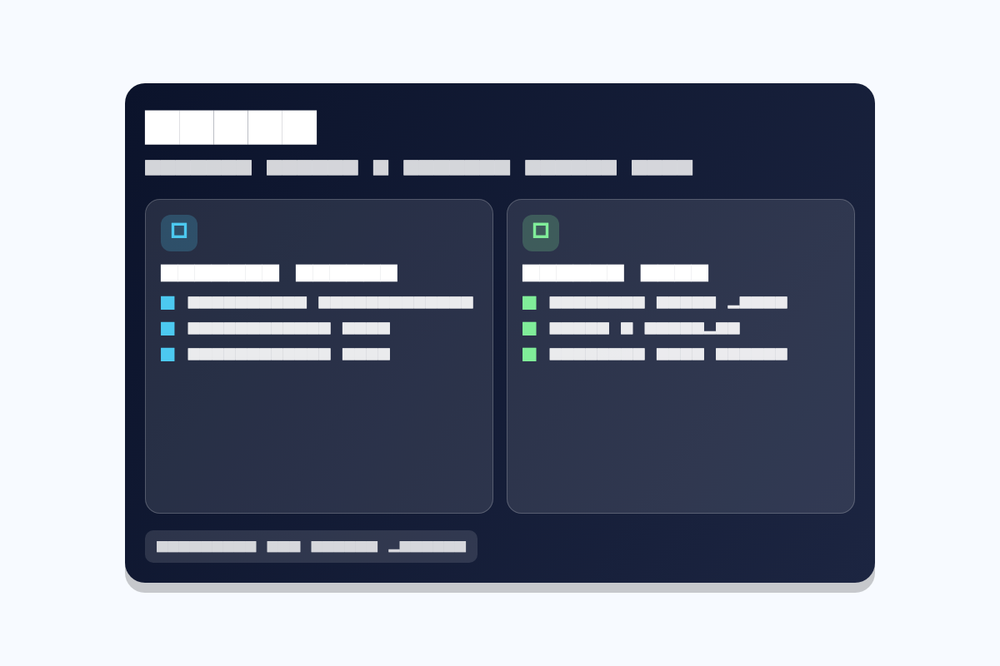

# ISWNG

[](https://github.com/fajarmuhammadsidiq/iswng/actions/workflows/ci.yml)
[](https://flutter.dev/)
[](https://dart.dev/)

ISWNG adalah project Flutter yang saat ini berfokus pada:

- utilitas **overlay tester** untuk uji perilaku sentuhan (tapjacking scenario)
- modul **memory game** bertema konten islami

Repository ini masih aktif dikembangkan, namun sudah memiliki fondasi testing unit untuk logic game.

## Preview



## Fitur Utama

### 1. Overlay Tester (default app entrypoint)

Lokasi: `lib/main.dart`

- cek status izin overlay
- request izin overlay
- tampilkan overlay dengan 2 mode:
  - `consumeTouch` (menelan sentuhan)
  - `clickThrough` (melewatkan sentuhan ke app di bawahnya)
- kirim data mode ke overlay listener
- tutup overlay

### 2. Memory Game Module

Lokasi utama: `lib/app/modules/home/views/home_view.dart`

- pilih kategori topik
- grid kartu berpasangan
- sistem nyawa (`lives`) dan jumlah percobaan (`attempts`)
- dialog menang dan game over
- logic permainan dipisah ke domain engine agar mudah diuji

Lokasi engine: `lib/app/modules/home/domain/memory_game_engine.dart`

## Stack Teknologi

- Flutter `3.24.3`
- Dart `3.5.3`
- State management/navigation: `get`
- Overlay integration: `flutter_overlay_window`
- Lint baseline: `flutter_lints`

## Struktur Project

```text
lib/
  main.dart
  app/
    modules/
      home/
        domain/
          memory_game_engine.dart
        views/
          home_view.dart
        controllers/
          home_controller.dart
        bindings/
          home_binding.dart
    routes/
      app_pages.dart
      app_routes.dart
test/
  unit/
    memory_game_engine_test.dart
  widget_test.dart
docs/
  testing-and-quality-gates.md
```

## Prasyarat

- Flutter SDK sesuai `.fvmrc` (direkomendasikan pakai FVM)
- Android device/emulator (terutama untuk pengujian overlay)

## Menjalankan Project

1. Install dependency:

```bash
flutter pub get
```

2. Jalankan aplikasi:

```bash
flutter run
```

Catatan: entrypoint default saat ini adalah Overlay Tester pada `lib/main.dart`.

## Testing dan Quality

- Jalankan seluruh test:

```bash
flutter test --no-pub
```

- Jalankan analyzer:

```bash
flutter analyze --no-pub
```

Dokumentasi lengkap quality gates ada di:

- [`docs/testing-and-quality-gates.md`](docs/testing-and-quality-gates.md)

## Roadmap Singkat

- tambah integration test untuk flow kritikal
- rapikan lint info/warning analyzer yang masih tersisa
- sambungkan modul memory game ke alur app utama secara penuh

## Referensi

- Flutter docs: https://docs.flutter.dev/
